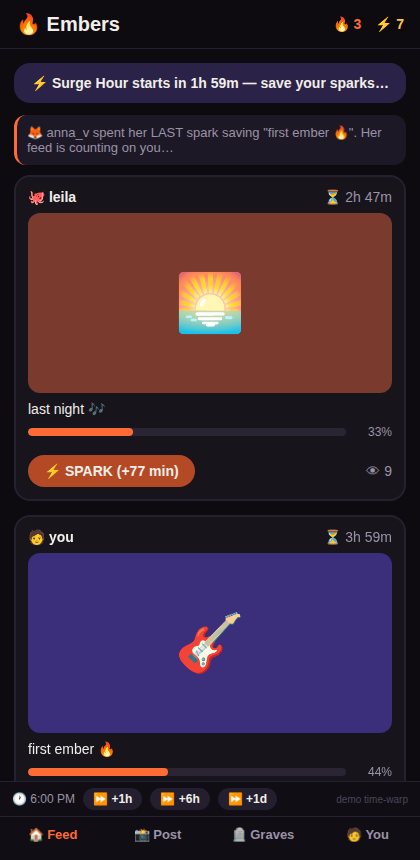
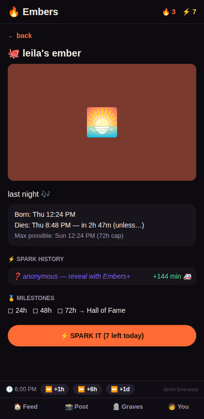
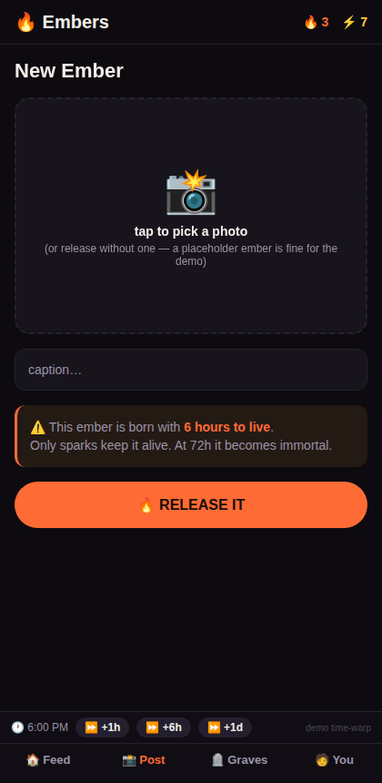
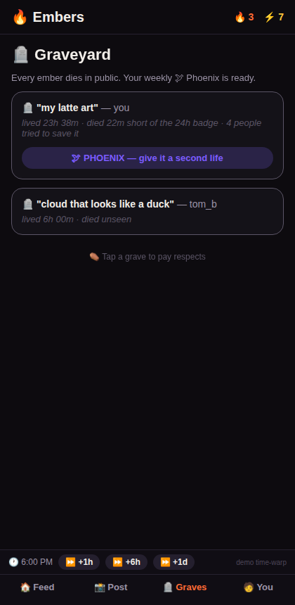
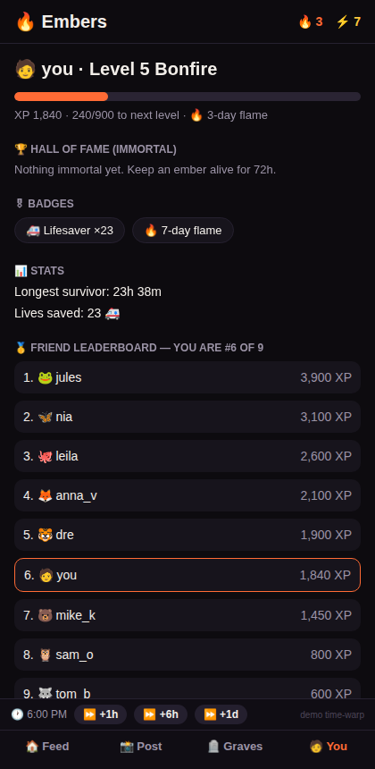

# 🔥 Embers — Concept

> A photo dies in 6 hours unless your friends keep it alive. Survive 72 hours and it becomes immortal.

Working title: **Embers**. Status: validated concept + interactive prototype (see this folder).

## 1. Where the idea came from, and what the research says

Original idea: photos/videos disappear after some hours unless views give them more time, gamified throughout.

Research verdict — the raw mechanic has been tried and the category has a documented failure pattern, but the viral DNA is real:

| Precedent | What happened | Lesson |
|---|---|---|
| **Plague** (2014) | "Content spreads like a virus or dies in 7 days." Never broke out. | The death mechanic alone doesn't retain. |
| **BeReal** | 20M → 6M DAU in ~6 months (2022–23). | Mundane ephemeral content gets boring fast. |
| **Poparazzi** | #1 on App Store 2021 → shut down 2023. | Users need a lasting identity/brand to invest. |
| **Dispo** | Hyped, then faded. | Delay/scarcity gimmicks aren't enough. |
| **Gas / tbh** | 1M DAU in 10 days, $5M revenue, acquired — dead within a year. | Gamified loops + school-by-school launch = explosive growth; novelty decay is the killer. |

So Embers keeps the original death-clock idea (it creates urgency and a built-in recruit-your-friends loop) and adds the three things the failures lacked: **scarcity** (sparks), **permanent identity** (Hall of Fame / XP / badges), and **rewards for viewers, not just posters**.

## 2. Core loop

1. You release an **ember** (photo + caption). It is born with **6 hours to live**.
2. Friends spend **sparks** (10 per day, refill at midnight) to extend it. Views alone do nothing — only sparks count.
3. Each spark is worth less than the last: 1st +90 min, then ×0.85 each (floor 8 min). **Hard cap: 72h** after birth.
4. At 0 it **dies publicly** into the Graveyard with an epitaph. Reach 72h alive and it becomes **immortal** in your Hall of Fame.

### The numbers (tunable in `src/engine/lifetime.ts`)

| Constant | Value | Why |
|---|---|---|
| Base lifetime | 6h | Short enough to need help on day one |
| First spark | +90 min | A single friend matters |
| Decay | ×0.85/spark | No view-farming to immortality |
| Hard cap | 72h | Death stays the point |
| Daily sparks | 10 | Scarcity = meaning + daily appointment |
| Rescue bonus | ×1.6 under 30 min | Saving a dying post feels heroic |

## 3. The addictiveness layer

Deliberately layered, strongest mechanics first:

1. **🌟 Golden Sparks** — ~1 in 20 sparks is worth 5×, with a celebration for both sides. Variable-ratio reward (the slot-machine schedule, the strongest known habit former).
2. **🔥 Daily Flame streak** — post or spark daily or your streak dies *publicly* in friends' feeds. Loss aversion (the Snapchat-streak mechanic).
3. **⚡ Surge Hour** — one random hour per day when all sparks count double. Appointment + FOMO (BeReal's random moment, attached to the economy).
4. **🤝 Reciprocity prompts** — "anna_v spent her last spark saving your post. Her ember dies in 2h…" Social debt re-opens the app.
5. **🪦 Near-miss epitaphs** — "died 22m short of the 24h badge." Near misses drive retries more than clean failures.
6. **❓ Anonymous sparker** — one sparker can be anonymous; revealing them is the premium upsell (this single mechanic was Gas's entire $5M engine).
7. **🕊 Phoenix** — once a week, resurrect one dead post. Makes the Graveyard a destination, adds "one more try."

### ⚖️ Ethics & regulatory note (decide before launch)

Mechanics 1–3 are precisely what App Store review and teen-safety regulators scrutinize (Gas was investigated; Snapchat streaks have been cited in litigation; see KOSA-style bills). If the target audience includes minors, decide deliberately where the compelling-vs-exploitative line sits: e.g. streak "freezes", daily usage nudges, no paid sparks for under-18s. Ephemeral content also still requires full moderation tooling for app-store approval.

## 4. Go-to-market (the Gas playbook)

- **Never launch globally.** Seed one tight community at a time (a campus, a team, a friend group ≥8 people) so sparks are dense enough that posts visibly survive. A dead global feed on day one is fatal for this mechanic specifically.
- The mechanic is the growth loop: saving your own post requires recruiting viewers → contact-book invites with real intent behind them.
- Tune `lifetime.ts` so a 5-friend circle can keep a good post alive ~24h. That number is the whole game.

## 5. Monetization (later)

- **Embers+** subscription: reveal anonymous sparkers, +sparks, cosmetic flames (prototype has the paywall stub).
- Cosmetics: flame colors, grave styles, celebration effects. Never sell lifetime directly to adults' followers' detriment — selling immortality kills the game.

## 6. Roadmap after the prototype

1. Video embers (short clips, same rules).
2. Real backend: Supabase (auth, storage, realtime sparks, TTL deletion via scheduled functions).
3. Push notifications ("Your ember has 30 minutes. 3 friends are online.") — the retention engine.
4. Moderation: report flow + review queue (app-store requirement even for ephemeral content).
5. Group spaces ("Circles") to operationalize the community-by-community launch.

## 7. Prototype in this folder

Expo (React Native, TypeScript) app, photos only, **no server** — a seeded simulation plays your friends: they post, spark, rescue dying embers, and maintain streaks, so the world is alive on first open. A **time-warp bar** (+1h/+6h/+1d) lets you feel a whole life-and-death cycle in seconds.

```bash
cd embers
npm install
npx expo start --web   # browser, phone-sized
npx expo start         # scan QR with Expo Go for a real phone
npm run typecheck      # tsc --noEmit
npx tsx scripts/smoke.ts  # engine smoke test (18 checks)
```

| Screen | What it shows |
|---|---|
|  | **Feed** — life bars, countdowns, spark buttons with exact value, Surge banner, reciprocity cards |
|  | **Detail** — born/dies, spark history with diminishing returns, anonymous sparker, milestones |
|  | **Capture** — "born with 6 hours to live" → 🔥 RELEASE IT |
|  | **Graveyard** — epitaphs, near-misses, weekly Phoenix |
|  | **Profile** — level/XP, Hall of Fame, badges, friend leaderboard |
